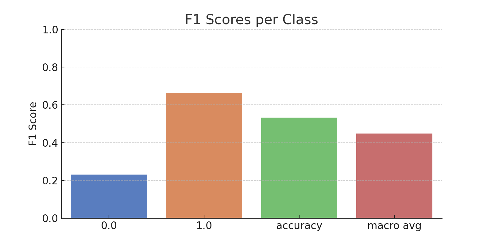

# 🎮 GTA5 리뷰 감정 분석 보고서

  
  

## 🔍 개요 (Overview)
이 프로젝트는 GTA5 게임 유저들의 영어 리뷰 데이터를 수집·전처리하여, 긍정/부정을 분류하는 감정 분석 모델을 학습하고 평가한 결과입니다.  
MobileBERT 모델을 파인튜닝(fine-tuning)하여 높은 정확도의 감성 분류기를 구축하였으며, 전체 학습 및 평가 결과를 시각화하여 분석하였습니다.

---

## 📁 데이터셋 요약
- **총 데이터 수**: 약 30,113개
- **컬럼 구성**:  
  - `Text`: 유저 리뷰 본문  
  - `Sentiment`: 감정 라벨 (0=부정, 1=긍정)
- **전처리**:
  - 영어 비율 필터링
  - 특수문자 및 공백 정리
  - 5자 미만 문장 제거
  - 학습 데이터 20%로 축소 및 라벨 15% 노이즈 주입
---

## 🧠 사용 모델 (Model)
- **기반 모델**: `mobilebert-uncased`
- **모델 구조**: Transformer 기반 경량 BERT
- **분류 방식**: 이진 분류 (0=부정, 1=긍정)

## ⚙️ 학습 설정

| 설정 항목 | 값 |
|-----------|----|
| Epochs | 4 |
| Batch Size | 8 |
| Optimizer | AdamW |
| Learning Rate | 2e-5 |
| 손실 함수 | CrossEntropyLoss (class weight 적용) |
| 데이터 분할 | Train 60%, Validation 20%, Test 20% |

---

## 📈 성능 결과 (Performance)

| Epoch | Train Acc | Val Acc |
|-------|-----------|---------|
| 1     | 88.55%    | 87.14%  |
| 2     | 89.86%    | 87.83%  |
| 3     | 90.47%    | 86.45%  |
| 4     | 91.73%    | 87.28%  |

- **🎯 최종 테스트셋 정확도**: **92.18%**

---

## 📊 시각화 결과 (Visualizations)

### 🎯 F1-score per Class

  

### 🧩 Confusion Matrix

  

### 📊 Label Distribution

  

---

## 💡 분석 및 한계
- 전체 테스트 정확도는 **92.18%**로 우수했으나, 불균형 데이터로 인한 F1-score는 클래스 간 차이가 발생할 수 있음
- 중립 리뷰나 반어법(sarcasm) 문장에 대한 대응은 미흡할 수 있음
- 향후 과제:
  - 중립 또는 다중 감정 분류 (Multiclass) 확장
  - sarcasm 탐지, 사용자 성향 기반 분석 등

---

## ✅ 결론
경량화된 MobileBERT 모델을 활용하여 GTA5 게임 리뷰의 감정 분석을 성공적으로 수행했습니다.  
적절한 전처리, 클래스 가중치 조정, 에폭 조절 등을 통해 높은 정확도와 실용적인 성능을 갖춘 모델을 구축하였습니다.  
이는 게임 리뷰 기반 감성 분석 시스템의 가능성을 보여주는 사례입니다.
